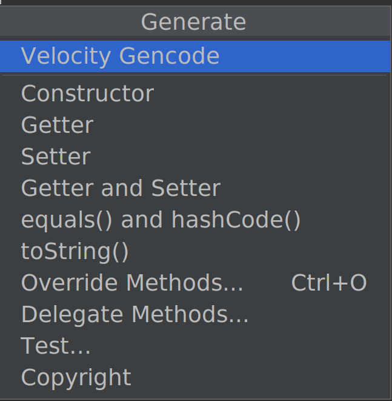
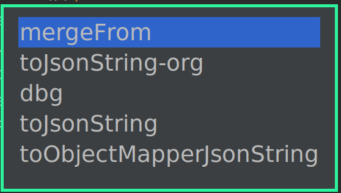

# velocity-codegen-plugin

This Intellij plugin enables you to inject code into 
Java classes via <a href="https://velocity.apache.org/engine/1.7/">Velocity templates</a>

The plugin uses version 1.7 of Apache Velocity as that is the embedded 
version in Intellij and other versions would cause issues.

# Usage

This plugin adds a choice called "Velocity Gencode" 
to the Generate Code dialog (Default shortcut: Alt+Insert).



It will present you with a list of the Velocity templates configured (see below).



The default keyboard shortcut for the velocity-gencode dialog is `Alt+Shift+V`

# Configuration

Add your velocity templates to the 
`$HOME/.config/velocity-codegen-plugin/templates` 
directory with the `.vm` extension.

The following variables are setup for the code-generator:

| Variable            | Description                                                                                                                                                          |
|---------------------|----------------------------------------------------------------------------------------------------------------------------------------------------------------------|
| $class              | PsiClass reference to the current java class                                                                                                                         |
| $StringUtils        | An instance of  <a href="https://commons.apache.org/proper/commons-lang/apidocs/org/apache/commons/lang3/StringUtils.html">org.apache.commons.lang3.StringUtils</a>  |
| $date               | current date (java.util.Date instance)                                                                                                                               |
| $allFields          | array of fields in the class and all its superclasses.                                                                                                               |
| $fields             | array of fields in the class                                                                                                                                         |
| $javaVersion        | instance of <a href="https://github.com/JetBrains/intellij-community/blob/master/platform/util/src/com/intellij/util/lang/JavaVersion.java">Intellij JavaVersion</a> | 
| $javaFeatureVersion | JavaVersion.feature                                                                                                                                                  |
| $javaMinorVersion   | JavaVersion.minor                                                                                                                                                    |                                                                                                                                                   |
| $javaUpdateVersion  | JavaVersion.update                                                                                                                                                   |

NOTE: The `$javaFeatureVersion`, `$javaMinorVersion` and `$javaUpdateVersion` 
are separate variables as Velocity cannot access public fields.

The instances in `$fields` and `$allFields` are collections 
of [`FieldDeclaration`](./src/main/java/com/pehrs/velocitycodegenplugin/FieldDeclaration.java) instances
for easier access to field details. 

The `FieldDeclaration` has the following attributes:

| Attribute | Description |
|-----------|-------------|
| $field.getType() | The field type |
| $field.getName() | The field name | 
| $field.isStatic() | true if field is static |
| $field.isPublic() | true if field is public |
| $field.isProtected() | true if field is protected |
| $field.isPrivate() | true if field is private |
| $field.isArray() | true if field is an array |
| $field.isCollection() | true if field is a collection (Set or List) |
| $field.isSet() | true if field is a java.util.Set |
| $field.isList() | true if field is a java.util.List |


If you need get the [PsiFields](https://github.com/JetBrains/intellij-community/blob/master/java/java-psi-api/src/com/intellij/psi/PsiField.java) 
for the class, then you can use
`$class.getFields()` or `$class.getAllFields()` instead of `$fields` or `$allFields`.

## Examples

Here's an example template that generates a merge method:
```velocity
public void mergeFrom($class.getName() from) {
#foreach($field in $fields)
#if(!$field.isStatic())
    this.set$StringUtils.capitalize($field.getName())(from.get$StringUtils.capitalize($field.getName())());
#end
#end
}
```
The template would generate something like this:
```java
    public void mergeFrom(EntitySample from) {
        this.setState(from.getState());
        this.setName(from.getName());
        this.setTotal(from.getTotal());
    }
```

More examples can be found in the [`examples`](./examples) dir.

# Build

```shell
# Verify
./gradlew runPluginVerifier
# Build the distributable zip (./build/distributions/velocity-codegen-plugin-1.0-SNAPSHOT.zip)
./gradlew buildPlugin
```